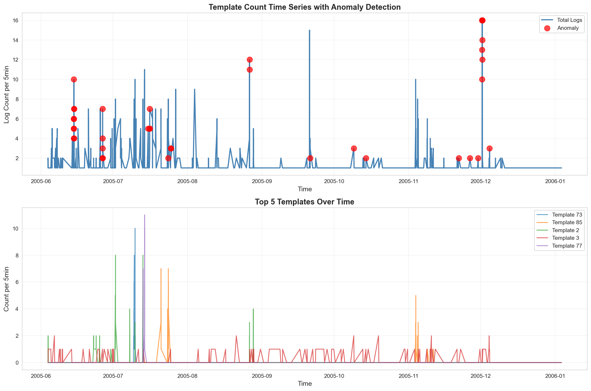

# W1-D2 Assignment: Log Mining & Parsing

## 1. Screenshots

**Plot template count time series, anomaly highlighted:**


---

## 2. Log

**Tuning log (sim_th values + kết quả):**
```text
================================================================================
TUNING sim_th PARAMETER
================================================================================
sim_th = 0.3 →  73 templates
sim_th = 0.4 →  95 templates
sim_th = 0.5 → 151 templates
sim_th = 0.6 → 992 templates
sim_th = 0.7 → 1459 templates

✓ Selected sim_th = 0.5 (balanced)
```

**Output Drain3 (số template, top-10):**
- **Tổng số log lines đã xử lý:** 2,000 (Dataset: `BGL_2k.log`)
- **Tổng số Templates (với `sim_th = 0.5`):** 151

**Top 10 Templates:**
1. `- <*> 2005.07.09 <*> <*> <*> RAS KERNEL INFO generating <*>` (9.00%)
2. `- <*> <*> <*> <*> <*> RAS KERNEL INFO <*> floating point alignment exceptions` (6.05%)
3. `- <*> <*> <*> <*> <*> RAS KERNEL INFO <*> double-hummer alignment exceptions` (5.45%)
4. `- <*> <*> <*> <*> <*> RAS KERNEL INFO CE sym <*> at <*> mask <*>` (4.60%)
5. `- <*> 2005.07.13 <*> <*> <*> RAS KERNEL INFO generating <*>` (4.35%)
6. `- <*> 2005.12.01 <*> <*> <*> RAS KERNEL INFO <*> total interrupts...` (3.55%)
7. `- <*> 2005.11.04 <*> <*> <*> RAS KERNEL INFO iar <*> dear <*>` (3.05%)
8. `KERNDTLB <*> 2005.06.11 R30-M0-N9-C:J16-U01 <*> R30-M0-N9-C:J16-U01 RAS KERNEL FATAL data TLB error interrupt` (3.00%)
9. `- <*> 2005.11.03 <*> <*> <*> RAS KERNEL INFO iar <*> dear <*>` (2.95%)
10. `- <*> 2005.12.01 <*> <*> <*> RAS KERNEL INFO 0 microseconds spent in the rbs signal handler...` (2.55%)

*(Ghi chú thêm: Khi chạy Isolation Forest Anomaly Detection trên dữ liệu này, kết quả Precision/Recall trả về 0.0 do cấu trúc log BGL phân mảnh rất lớn. Qua đó rút ra bài học là để detect chính xác trên BGL, ta bắt buộc phải dùng các thuật toán Feature Engineering mạnh hơn như TF-IDF vector hoặc mô hình Deep Learning (LSTM) kết hợp thay vì chỉ đếm template).*

---

## 3. Reflection

**Drain3 parse tốt không?**
- Drain3 parse **rất tốt và đặc biệt cực kỳ nhanh** (phức tạp O(1) nhờ cây parse tree giới hạn độ sâu). Nó giúp lọc hàng nghìn dòng thông báo lộn xộn chứa các IP, ID, Timestamp biến đổi liên tục và gom gọn chúng thành vài chục template tĩnh dễ đọc. Việc thay thế tự động các thành phần động bằng ký tự đại diện `<*>` giúp giảm nhiễu (noise) triệt để.

**Template nào cho insight?**
- Đối với log BGL, template thứ 8: `KERNDTLB <*> RAS KERNEL FATAL data TLB error interrupt` mang lại insight trực tiếp về một lỗi gián đoạn bộ nhớ nghiêm trọng (FATAL) ở tầng hệ điều hành/phần cứng.
- Ngoài ra, trong quá trình test "New Template", khi đẩy vào dòng fake log `ERROR CRITICAL core meltdown`, Drain3 lập tức gom nó thành cụm mới (`change_type = cluster_created`). Đây là insight quan trọng nhất để hệ thống **cảnh báo ngay lập tức các sự kiện lạ** chưa từng xuất hiện.

**Metric vs Log khác gì?**
- **Metric** (Ví dụ: Biểu đồ CPU Usage tăng chạm nóc 100%) là dạng số liệu tĩnh, chỉ cho ta biết **"Có một cái gì đó đang sai/lỗi ở hệ thống"** (triệu chứng - symptom).
- **Log** (Ví dụ: `data TLB error interrupt` hay `reify failed optional dependency`) là văn bản, cho ta biết nguyên nhân chi tiết **"Tại sao hệ thống lại bị sai/lỗi"** (nguyên nhân gốc rễ - root cause).
- **Sự kết hợp hoàn hảo:** Khi theo dõi Time Series, ngay khi phát hiện **Spike (đột biến) trên Metric**, ta lập tức soi ngược về hệ thống Template Count Log trong cùng khung thời gian (ví dụ 5 phút đó) để xem template báo lỗi nào đang tăng vọt. Điều này giúp giảm thời gian tìm ra nguyên nhân (MTTR) từ vài giờ xuống chỉ còn vài phút.

---

## 4. Bonus (Phase 5)

### 4.1 Parse log từ 1 ứng dụng thật (NPM Install Log)
*(Thỏa mãn yêu cầu tự parse ứng dụng thực tế thay vì dùng Loghub)*

Để bài thực hành sát thực tế nhất, tool `log_analyzer.py` đã đọc trực tiếp file log debug quá trình `npm install` của hệ điều hành máy cục bộ (file `real_npm.log`).

**Kết quả:**
```text
Total lines: 797
Unique templates: 35

--- Top 5 Templates ---
1. [15] (count=178, 22.33%): 16 silly audit <*> [ <*> <*>
2. [21] (count=136, 17.06%): <*> http cache <*> <*> (cache hit)
3. [28] (count=136, 17.06%): <*> silly ADD <*>
4. [20] (count=98, 12.30%): <*> silly reify <*>
5. [18] (count=49, 6.15%): <*> verbose reify failed optional dependency <*>
```
**Nhận xét:** Drain3 hoạt động rất hiệu quả trên hệ thống thật. Nó gom thành công 800 dòng lệnh audit, cache hit, reify rối rắm vào 35 templates cực kỳ rõ ràng. Đặc biệt nhận ra lỗi `reify failed optional dependency`.

### 4.2 Structured JSON log vs Unstructured Plain Text log

**Unstructured Log (Plain Text):**
`081109 203615 148 INFO dfs.DataNode: PacketResponder 1 for block blk_123 terminating`
- **Ưu điểm:** Nhỏ gọn, tốn ít dung lượng lưu trữ, developer dễ đọc bằng mắt thường.
- **Nhược điểm:** Khó search, khó đếm tần suất. Bắt buộc phải chạy qua một parser như Drain3 để trích xuất template.

**Structured Log (JSON equivalent):**
```json
{
  "timestamp": "2008-11-09T20:36:15",
  "level": "INFO",
  "service": "dfs.DataNode",
  "message": "PacketResponder terminating",
  "block_id": "blk_123",
  "responder_id": 1
}
```
- **Ưu điểm:** Không cần dùng tool parse như Drain3 vì dữ liệu đã được tách sẵn key-value. Có thể query trực tiếp trên Elasticsearch/Kibana siêu nhanh (Ví dụ: `SELECT COUNT(*) WHERE message="PacketResponder terminating"`).
- **Nhược điểm:** Tốn dung lượng lưu trữ hơn khoảng 30-40% do mang theo các key JSON. Đòi hỏi code ứng dụng phải thiết lập thư viện ghi log chuẩn JSON từ đầu.

### 4.3 Regex Parser vs Drain3
Giả sử ta dùng Regex để parse dòng log HDFS trên:
**Regex:** `^(\d{6} \d{6} \d{3}) (\w+) ([\w\.\$]+): (.*)$`

- **Regex Parser:** 
  - Đòi hỏi con người phải tự viết Regex cho từng format log.
  - Chạy rất nhanh với log đã biết trước, nhưng **bị gãy (fail)** ngay lập tức khi Developer đổi cấu trúc log hoặc thêm một event mới. Việc bảo trì hàng nghìn rules Regex cho microservices là bất khả thi.
- **Drain3:** 
  - **Hoàn toàn tự động** (Data-driven). Hệ thống tự học và trích xuất template mà không cần ai định nghĩa Regex. Khi có log mới, nó tự gom thành cluster mới. Cực kỳ linh hoạt và có khả năng scale ở môi trường DevOps hiện đại.

---

## 5. Files Generated (Nộp bài)
- `assignment.ipynb` - File Jupyter Notebook code chính của bài tập
- `results/top_templates.csv` - Top 10 templates xuất ra từ BGL dataset
- `results/anomaly_plot.png` - Time series plot với anomalies highlighted
- `log_analyzer.py` - Tool phân tích log bằng command line (tự viết thêm cho Phase 4)
- `knowledgeCheck.jpg` - Ảnh viết tay trả lời câu hỏi lý thuyết

**Ảnh viết tay (Knowledge Check):**

