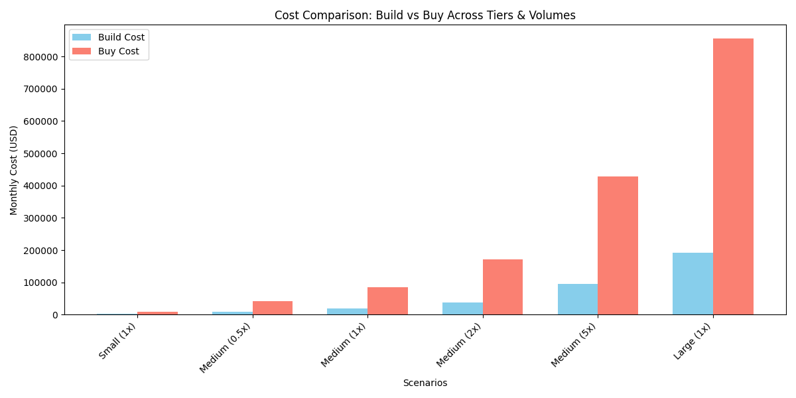

# Bài nộp W1-D3: Data Layer Architecture + Observability Pipeline

Họ tên: Bùi Lê Tuấn (aiops-BuiLeTuan)

## 1. Architecture Diagram
*Sơ đồ thiết kế End-to-End Data Layer cho Use case: Anomaly detection trên payment service*

Kiến trúc bao gồm: Payment Service (Sinh data) -> OTel Collector (Thu thập) -> Kafka (Đệm) -> Flink (Xử lý stream) -> VictoriaMetrics/ES (Lưu trữ) -> Grafana/ML (Sử dụng).

*(Chi tiết xem file [architecture.md](./architecture.md))*

## 2. Bảng Cost Estimate
Output từ script `cost_model.py`:

| Scenario      |   Logs (GB/day) |   Metrics (eps) |   Build Cost |   Buy Cost |
|:--------------|----------------:|----------------:|-------------:|-----------:|
| Small (1x)    |              50 |      100000     |       2410.1 |       8555 |
| Medium (0.5x) |             250 |      500000     |      10050.5 |      42775 |
| Medium (1x)   |             500 |           1e+06 |      19601   |      85550 |
| Medium (2x)   |            1000 |           2e+06 |      38702.1 |     171100 |
| Medium (5x)   |            2500 |           5e+06 |      96005.2 |     427750 |
| Large (1x)    |            5000 |           1e+07 |     191510   |     855500 |

*(Lưu ý: Giá trên chỉ là mô hình ước tính giả định, Build bao gồm cả Storage Hot/Warm/Cold, Compute throughput-based và Network Egress. Buy dựa theo bảng giá Datadog).*

**Breaking Point Analysis:**
- Tại Small (1x): Build rẻ hơn Buy 3.5 lần (Tiết kiệm $6,145/tháng)
- Tại Medium (1x): Build rẻ hơn Buy 4.4 lần (Tiết kiệm $65,949/tháng)
- Tại Large (1x): Build rẻ hơn Buy 4.5 lần (Tiết kiệm $663,990/tháng)

## 3. Tóm tắt ADR Decision
- **ADR-001**: Sử dụng Kafka làm Buffer Layer.
- **Quyết định**: Không bắn trực tiếp data vào DB nữa mà cho đi qua Kafka.
- **Lý do**: Ngăn chặn tình trạng rớt (drop) log/metric khi hệ thống quá tải đột ngột (spike). Đảm bảo tính sẵn sàng của data cho AIOps.
- **Trade-off**: Chấp nhận tốn thêm ~$2000/tháng cho infra và tăng thêm một chút latency (10-20ms) đổi lấy sự ổn định tuyệt đối của Storage và không mất data.

## 4. Reflection Question
> Nếu bạn được hire làm Platform Engineer cho startup 50-service vừa raise Series A, bạn sẽ recommend build hay buy? Tại sao?

**Câu trả lời:**
Tôi sẽ đề xuất **BUY (sử dụng các nền tảng SaaS như Datadog hoặc New Relic)** ở giai đoạn này thay vì Build.

**Lý do:**
1. **Focus vào Product:** Startup ở vòng Series A cần tốc độ phát triển sản phẩm nhanh nhất có thể để chiếm thị phần. Việc tiêu tốn nhân lực kỹ thuật (SRE/Platform Engineer) vào việc duy trì, bảo trì 1 hệ thống Kafka, Elasticsearch, Prometheus (đòi hỏi rất nhiều thời gian, công sức quản lý) là một sự lãng phí tài nguyên không đáng.
2. **Time to first value:** Các nền tảng Buy (Datadog) có thể setup xong và ra được dashboard/alert hoàn chỉnh trong 1-2 tuần, trong khi tự Build có thể tốn 3-6 tháng để thực sự đi vào hoạt động trơn tru.
3. **Chi phí nhân sự vs SaaS:** Mặc dù chi phí SaaS ở quy mô 50 service rơi vào khoảng vài ngàn đến hàng chục ngàn đô la một tháng, chi phí này vẫn rẻ hơn (hoặc tương đương) việc phải tuyển dụng và trả lương cho một đội 2-3 kĩ sư Data/SRE chuyên trách duy trì hệ thống tự build tại thời điểm này. Khi nào công ty scale lên mức >500 engineers và hoá đơn SaaS lên mức quá sức chịu đựng, tôi mới cân nhắc kế hoạch chuyển dịch sang tự Build dần.
