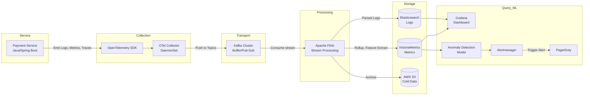

# Data Layer Architecture: Anomaly Detection for Payment Service

Sơ đồ kiến trúc toàn trình (End-to-End Data Layer) mô tả đường đi của dữ liệu từ Payment Service đến hệ thống AIOps phục vụ cho bài toán phát hiện dị thường (Anomaly Detection).

## Diagram



## Giải thích các thành phần (Component Choices)

1. **Service**: Payment Service tạo ra các dữ liệu telemetry như số lượng giao dịch, độ trễ, và log thanh toán bị lỗi.
2. **Collection**: Sử dụng **OpenTelemetry SDK** nhúng thẳng vào ứng dụng để thu thập.
   - **Trace Sampling Strategy:** Sử dụng *Tail-based sampling*. Giữ 100% các request bị lỗi (Error/HTTP 500) và request bị chậm (>500ms), nhưng chỉ giữ lại 1% (sample rate = 0.01) đối với các request thành công để tiết kiệm chi phí lưu trữ Trace.
3. **Transport**: Sử dụng **Kafka** làm Message Queue. Đảm bảo khi hệ thống có spike giao dịch (ví dụ: Black Friday), Storage không bị sập và dữ liệu không bị mất.
4. **Processing**: Dùng **Apache Flink** để thực hiện Stream Processing (ví dụ: Join metric với log, tính rolling mean 5 phút của độ trễ thanh toán).
5. **Storage**: 
   - **VictoriaMetrics**: Lưu trữ Metric với truy vấn tốc độ cao.
   - **Elasticsearch**: Lưu log phục vụ cho việc tìm kiếm full-text search.
   - **S3**: Lưu trữ lạnh (cold storage).
   - **Retention Policy:**
     - **Hot Tier:** Lưu tại Elasticsearch/VictoriaMetrics (SSD) trong **7 ngày** phục vụ xử lý sự cố tức thời.
     - **Warm Tier:** Chuyển qua các node giá rẻ (HDD) trên ES trong **30 ngày**.
     - **Cold Tier:** Đẩy sang S3 dạng Parquet để lưu trữ lâu dài **1 năm** (phục vụ audit và train model).
6. **Query/ML & Alerting**: **Grafana** đọc dữ liệu từ VM và ES. **ML Model** tiêu thụ dữ liệu từ VM để chạy thuật toán Anomaly Detection. Nếu phát hiện dị thường, trigger **Alertmanager** và đẩy cuộc gọi/thông báo sang **PagerDuty** gọi trực tiếp cho On-call Engineer.

## Schema Registry / Data Contract Example
Để tránh việc thay đổi format log làm vỡ pipeline, hệ thống sử dụng Data Contract thông qua Avro Schema (lưu trên Schema Registry):

```json
{
  "type": "record",
  "name": "PaymentLogEvent",
  "namespace": "com.company.payment",
  "fields": [
    { "name": "timestamp", "type": "string" },
    { "name": "level", "type": "string" },
    { "name": "service_name", "type": "string", "default": "payment-service" },
    { "name": "order_id", "type": ["null", "string"], "default": null },
    { "name": "amount", "type": "double" },
    { "name": "status", "type": "string" },
    { "name": "error_code", "type": ["null", "int"], "default": null },
    { "name": "response_time_ms", "type": "int" }
  ]
}
```
Khối Schema này ép buộc Service Producer không được gửi type sai, giúp Consumer (Flink/Elasticsearch) an toàn không bị Exception.
